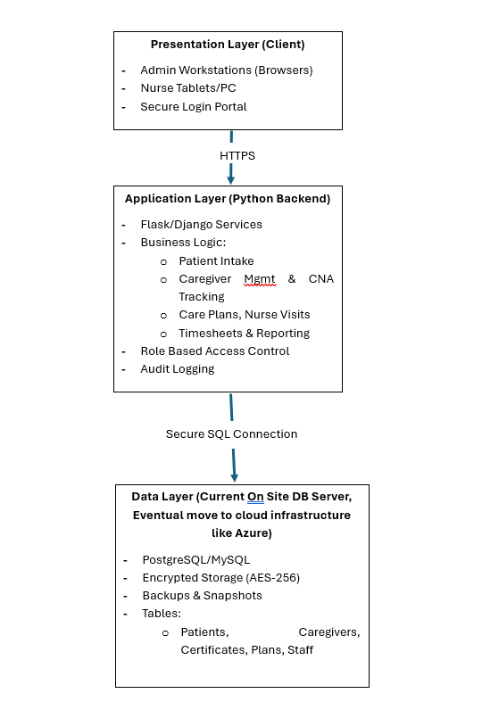
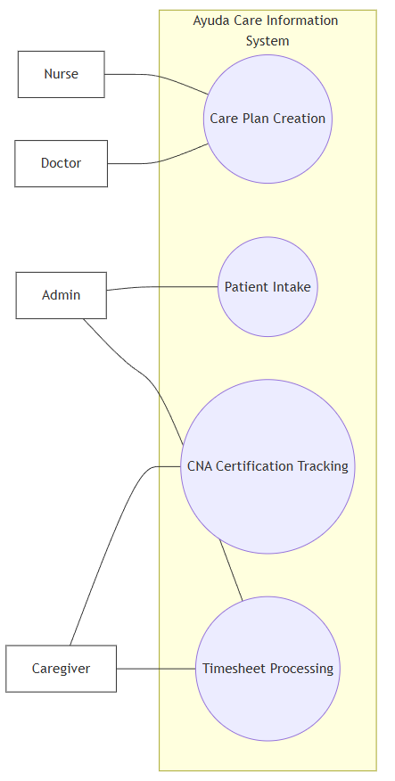
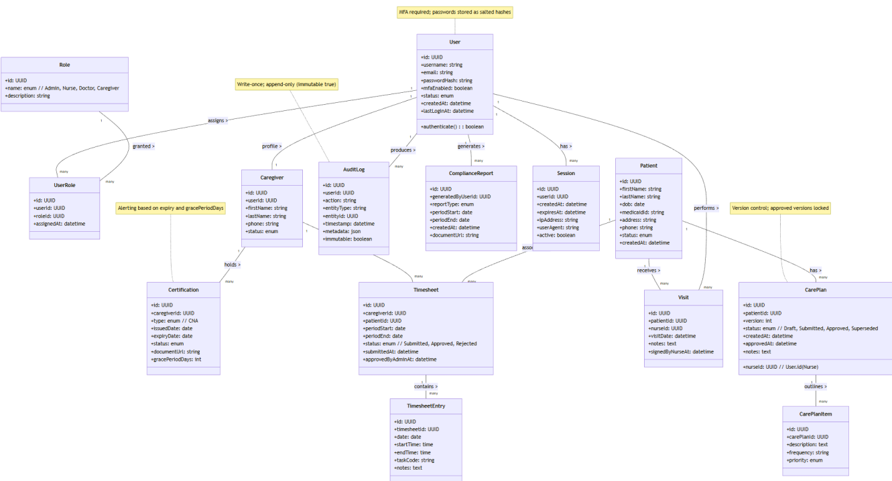
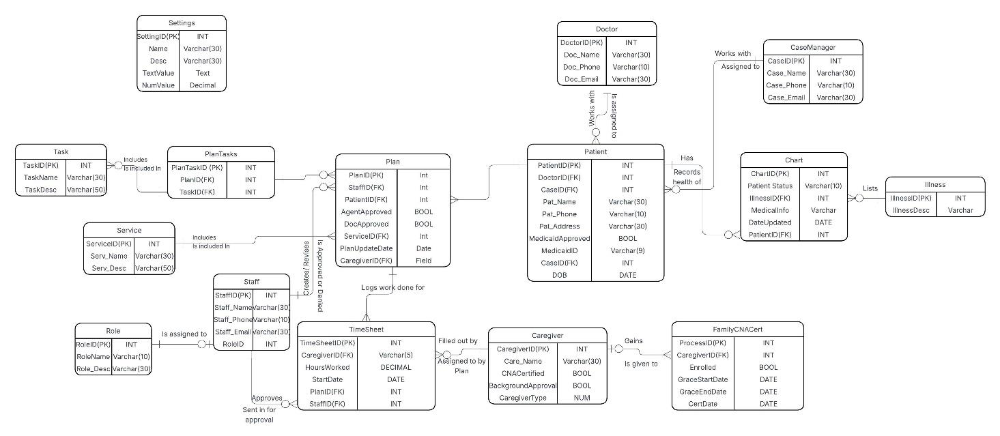
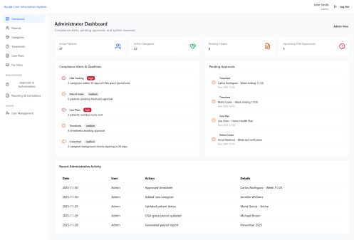
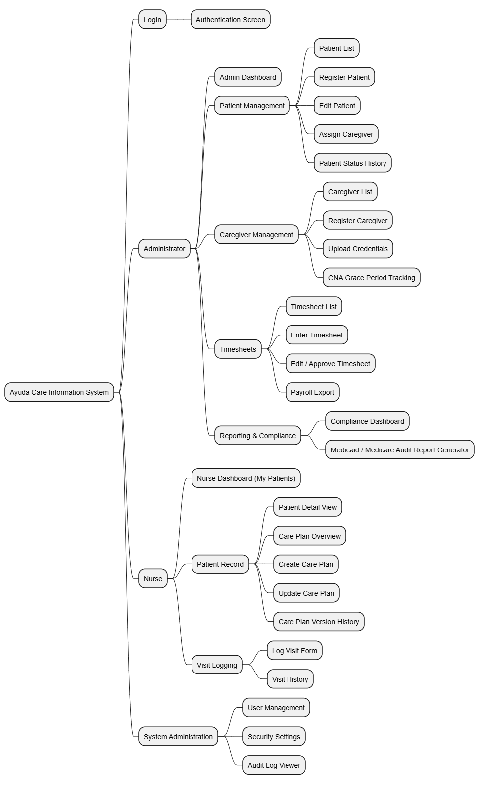

# Healthcare Information System — Systems Analysis & Design

This repository contains systems analysis, architecture and database design, process diagrams, interface prototypes, and a feasibility study for a healthcare information system, produced by **Riga Group** for an academic case study modeled on **Ayuda Home Care Agency**, a home health provider serving senior citizens in the Denver Metro Area through Medicare and Medicaid programs.

This is an academic analysis and design project: it includes a working interface prototype and a proposed implementation plan, but no production system was built or deployed.

- [Full proposal (PDF)](docs/healthcare-system-proposal.pdf)
- [Figma prototype (Annex)](https://cycle-rise-74433973.figma.site/)

## My Contribution

I, Christian Alemayehu, completed the requirements and workflow analysis, the three-tier architecture design, the relational database design (3NF, physical ERD, data dictionary), the process diagrams (use case, class, and DFDs), the interface prototypes, and the delivery/testing plan. The financial feasibility analysis (Section 7) was completed by other Riga Group members. Team attribution for the overall project is retained below.

## 1. Overview and Business Problem

Ayuda Home Care Agency manages patient intake, caregiver onboarding, CNA certification tracking, timesheets, and care plan documentation using paper forms and spreadsheets. This manual approach produces delayed approvals, inconsistent records, difficulty tracking caregiver certification deadlines, and slow retrieval of documentation during Medicaid and Medicare audits.

The case study models a centralized digital information system that would replace this paper-based process, reduce administrative workload, and improve audit readiness. Stakeholder needs (administrators, nurses, caregivers, and patients/families) were captured through simulated interviews and scenario-based analysis of typical workflows for a home care agency of this kind, along with analysis of representative document types (timesheets, approval forms, intake records). This was an academic exercise; it did not involve real agency staff or an actual client engagement.

## 2. Scope

The proposed system's scope covers six core areas of Ayuda's operations:

- **Patient intake** — digital registration, Medicaid/doctor approval tracking, and assigned caregiver status
- **Caregiver onboarding** — registration of independent and familial caregivers, credential and background-check tracking
- **CNA certification tracking** — monitoring of the four-month grace period for familial caregivers pursuing CNA certification, with automated deadline alerts
- **Care plans** — nurse-authored care plans with version history and doctor approval workflow
- **Timesheets** — staff-entered timesheet data (caregivers do not log in directly), hours worked per patient/service, and service interruption tracking
- **Reporting** — payroll-ready exports and audit-ready documentation bundles for Medicaid/Medicare reviewers

## 3. Requirements and Workflow Analysis

Requirements were derived from simulated interviews representing administrative staff and certified nurse roles, analysis of representative document types, and modeled workflows typical of a home care agency of this kind. Key findings from the case study:

- Administrative staff manage patient intake, caregiver onboarding, certification tracking, timesheets, and compliance reporting largely through paper files, causing delays and inconsistent recordkeeping.
- Certified nurses are the sole authors of care plans and rely on handwritten notes and faxed doctor signatures, which slows version control.
- Caregivers submit paper timesheets and will not interact with the system directly; staff enter caregiver-related data on their behalf.
- Patients and families lack visibility into intake status, driving repeated phone inquiries to office staff.

These findings were translated into functional requirements (patient management, caregiver/CNA certification, care plan, nurse visit logging, timesheet, and reporting requirements) and non-functional requirements (security/compliance, usability, and performance/availability), detailed in the [full proposal](docs/healthcare-system-proposal.pdf).

## 4. Architecture, Database Design, and Process Models

The proposed system follows a **three-tier architecture**:

- **Presentation layer** — browser-based interface for administrative workstations, with tablet support for nurses during home visits
- **Application layer** — business logic for intake, caregiver/CNA tracking, care plans, timesheets, and reporting; role-based access control and audit logging
- **Data layer** — a relational database normalized to **Third Normal Form (3NF)**



The database design includes a physical ERD, a complete data dictionary (tables, fields, data types, and examples), a use case diagram, and a class diagram covering core entities such as User, Patient, Caregiver, Certification, CarePlan, Timesheet, Visit, and AuditLog. Full DFDs (context and Level-0, covering seven core processes) are documented in the proposal.

| Use Case Diagram | Class Diagram |
|---|---|
|  |  |

**Physical ERD:**



Security and compliance controls referenced throughout this design (encryption at rest/in transit, multi-factor authentication, role-based access control, audit logging, HIPAA-aligned safeguards) are **proposed design requirements**, not verified or audited compliance.

## 5. Interface Prototypes

The interface design prioritizes minimal clicks (three to four for common tasks), progressive disclosure of form fields, and color-coded status indicators for certifications, approvals, and alerts. Role-based navigation separates the administrator workflow (patient intake, caregiver management, timesheets, reporting) from the nurse workflow (assigned patients, care plans, visit documentation).



*Prototype screen showing synthetic/placeholder data used for demonstration only. A full clickable prototype, including the administrator and nurse step-by-step workflows, is linked in the [Figma demo portal](https://cycle-rise-74433973.figma.site/) from the proposal's annex.*

The full screen hierarchy for both roles is mapped in the screen tree below:



## 6. Delivery Approach, Testing, and Maintenance

The proposal recommends an **Agile delivery approach** organized into three development sprints (admin/CNA, care plans/timesheets, reporting/compliance), each ending in a stakeholder demo, followed by a QA/bug-fix phase and a modeled user acceptance testing period.

Proposed quality practices include:

- Developer self-testing and peer code review before merge
- Black-box and regression testing against requirements
- Security and compliance testing of role-based access, MFA, and encryption
- Performance testing under simulated workload
- Bug tracking by severity, with **Jira** proposed as the issue-tracking tool

Post-launch, the proposal recommends scheduled maintenance, patching, and continuous compliance monitoring, backed by a five-year maintenance contract.

## 7. Financial Feasibility

Financial figures were simulated for the academic assignment; projected benefits illustrate the estimation method rather than validated business outcomes.

The proposal estimates administrative effort at **372 hours/year** under the current paper-based process (manual data entry plus audit preparation across four administrative staff), compared with a projected **115 hours/year** after automation — a reduction of **257 hours/year, approximately 69%**. At an assumed rate of $30/hour, this corresponds to a projected labor savings of **$38,550 over five years**.

The proposed five-year system cost is **$527,435**, driven primarily by development labor (three developers and a project manager, ~83.6% of the total), with the remainder covering hosting, integration, training, a contingency buffer, and a five-year maintenance contract.

The projected labor savings ($38,550) are modest relative to the total five-year investment ($527,435) and do not by themselves justify the cost.

## Team

This project was completed by **Riga Group**. See [My Contribution](#my-contribution) above for the individual work breakdown; the financial analysis in Section 7 was completed by other members of the team.

## Contents

```
docs/
  healthcare-system-proposal.pdf   # full original proposal
assets/                            # diagrams and prototype screenshots referenced above
```
